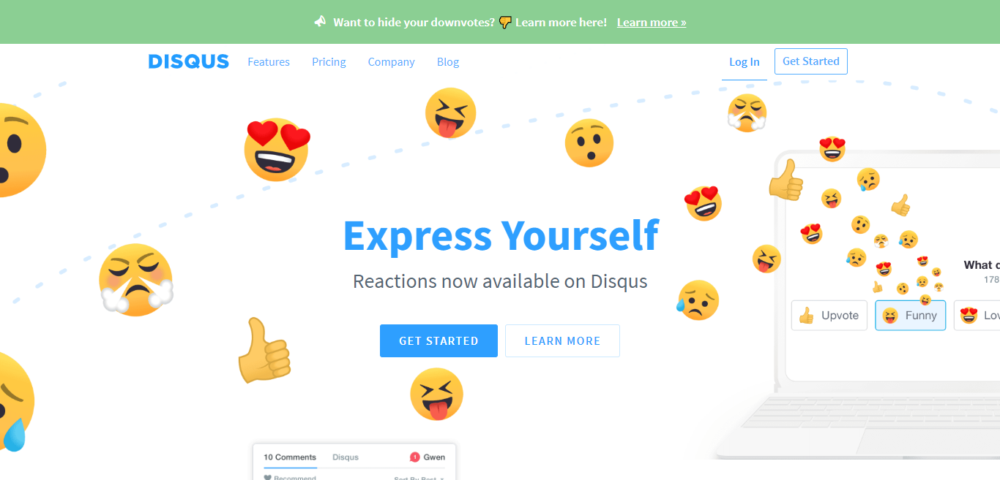

Are you travelling in the new bandwagon of static JAMstack website? If yes the you must be missing some of the ways to add the lost dynamic features like blog comments. Some of you might have even thought of completely removing it but let me ask you a question first, is a blog worth it if readers can't share their feelings? I'll share an example, few days back I wrote an article on [Dev.to↗](https://dev.to/devxify) about web accessibility. It looked great to be but later I got to know I messed up with Markdown and some words were just completely omitted in during HTML generation, thanks to the readers and the comment section that I got to know about that very soon. Now ask yourself, does your blog needs a comment system?

## Benefits Of Comments

1. Better Interaction
2. Easy Feedback Collection
3. Increased Time On-Page
4. Increased Trust

So after all these I too was looking for a comment system for my site, earlier I did had comments on my website provided by Just-Comments but they planned to shut down their service due to low revenue & traction and I was now left with no comment system. Also I didn't want to miss the awesome but occasional constructive feedback some of you guys leave in the comment section.

Now I had a tough decision to choose a comment system among different offering in the market, to do this I made a list of all viable and well known provider. My list compromised of :

1. Disqus
2. Hyvor Talk
3. Commento
4. Utteranc.es 

Now even though I had created a small list but I still had few requirements in back of my mind. The first and foremost was that the UI shouldn't suck and I do believe ads make the UI suck unless implemented in an extremely user friendly way. My second requirement was that the comment system must be light-weight and should load in a breeze (I'm a lover of webperf). The third and the last one was to be privacy friendly, if you guys have followed me then you much know how much value I give to user privacy accessibility.

(**P.S.** Spoiler Alert, I went with Utterances)

## Why I Didn't Choose Disqus

As much as I know, [Disqus↗](https://disqus.com/) is the largest by all terms among this list. They are a pretty matured business and as a comment system they have everything you wish but they also have somethings you don't wish for. First and foremost is that they come with ads in their free plan also apart from ads they also collect user data which means its very unfriendly to your privacy. Apart from privacy issue, they have performance issue too. If you implement their widget then that makes your webpage load slower than usual.


<p style="text-align: center; font-size:1.25rem">Disqus Landing Page</p>

Though comments are important to me but I won't have them at the price of user privacy and web performance. So this was the reason to keep myself away from Disqus.

## Why I Didn't Choose Hyvor Talk

[Hyvor Talks↗](https://talk.hyvor.com) looks great works great. It's just like a Disqus but with better privacy and faster load time. Hyvor Talk even has a generous free plan for upto 40,000 pageviews, when I had a look, it did felt awesome. 

Though I didn't have any issues regarding privacy, UI or performance but had some different kind of issue. The first issue I faced is in the way they charge users. The thing I found that though they based in Sri Lanka but still collect nation specific taxes like GST & VAT. I even had a chat with its maker and after few mails he told me that he would be getting back to me soon after discussing with their payment provider (It's Paddle Payment Gateway if you wish to know). I later got a response and after all that I believe that their whole tax thing is managed by Paddle and I personally am a very big fan of their service.


<p style="text-align: center; font-size:1.25rem">Hyvor Tallk</p>

Apart from this the another issue was my past experience with Just-Comments, though I wish Hyvor Talk a great success but still startups do work on the swords edge and didn't want my comment system provider to vanish soon. Also a lack of annual plan was a bummer for me as annual plan generally have a discounted price compared to monthly. Though it's completely my feeling, you are free to take a trial and share your experience in the comment system, I have seen some people who are pretty happy and satisfied with Hyvor Talk.

## Why I Didn't Choose Commento

[Commento](https://commento.io/) is a privacy focused commenting tool. They too have most of the features you wish from a comment system but they require a minimum payment of 5$ per month which is on a higher side for small blogs and portfolio sites. Apart from this they have everything you wish for.

If your wallet allows then you will have access to automatic moderation tool, API access, shadow banning, single sign-on, sticky comments and much more. Even though I didn't went with them but they are indeed worth a try. Also Commento has a self-host version too where you can skip paying them and directly host them, I didn't self-host it because I believe in static and [JAMstack↗]() sites and avoid managing servers.

## Why I Chose Utterances

If you visit my site you will see that I have already implemented [Utterances↗](https://utteranc.es/) there to manage comments. Also among all others Utterances is the most unique one in terms of managing comments. They use GitHub issues to store and display comments on to your webpage and each webpage is identified as a different issues.

I went with Utterances because it free to use as long as you stay under the limits of GitHub issues API. Also as my site is more focused to developers so everyone generally has a GitHub account and it makes the sign-in process ease. I believe that Utterances is the most basic offering here but sometimes basic is what you.

Though I have been using them for a while but they still have some cons, the biggest is lack of moderation of comments. It's practically impossible to moderate comments and GitHub doesn't has such feature as of now, the only way around is to personally block/delete comments which you find useless or spam. Also as it uses GitHub issues API so you also get to use reactions on others comments. If you are like me who gets few comments on your webpage then this not an issue. Last but not the least, Utterances implements comments on your webpage within a rendered `<iframe>` which mean that Utterances has no SEO benefit, on the brighter site the spam (if any) won't affect your SEO in a negative way too.

### Utterances Implementation

1. Create a GitHub repo to store your comments.
2. Install Utterances Bot to the repo.
3. Go to Utterances site and generate script based on repo name and style.
4. Simple paste the script after the end of the content.

```html
<!--Here's the sample code for Utteranc.es-->
<script src="https://utteranc.es/client.js"
        data-repo="owner/repo-name"
        data-issue-term="pathname"
        data-theme="github-light"
        crossorigin="anonymous"
        async>
</script>
```

Phew! It's done go and write your first comment. Also just to let you know that as Utterances is based upon GitHub issues so it does support markdown natively which is a great plus if your audience is mostly web developers. Now that it's done you can play with it or me and the Utterances community to make it better. Currently I am working on a way to cache GitHub API calls on client side so that I can reduce number of API lookups in case of multiple refreshes (If you refresh multiple time GitHub blocks API request for few minutes), I am trying to use service workers to solve this and if I am able to do so then I'll surely update this article (In-case you feel you can help me the do let me know in the comment section or mail me).

### Conclusion

Utterances is a great option for anyone whose audience comprises of mostly developers/coders. Using GitHub login makes it easier for all developers to comment and interact. Other features like reaction and markdown support comes handy too and make the system efficient.

Please don't test the comment system here, visit [utteranc.es↗](https://utteranc.es) to test.

If you really likes the article the do share it with your friends and colleagues. If you find a error or just want to do addition to this post then feel free to drop a message on [Twitter↗](https://twitter.com/devxify), also do follow us for quick updates. For weekly updates on web performance and optimization do subscribe to our newsletter. If you wish to support my work (which I do here for free) then you can do so by [buying me a coffee↗](https://www.buymeacoffee.com/Devxify) or two, I'll be thankful.

<p style="text-align:center">
<a href="https://www.buymeacoffee.com/Devxify" rel="noreferrer nofollow" target="_blank"></a>
</p>
<!--Comments System-->
<script src="https://utteranc.es/client.js" data-repo="Devxify/devxify-comment" data-issue-term="pathname" data-theme="github-light" crossorigin="anonymous" async>
</script>
