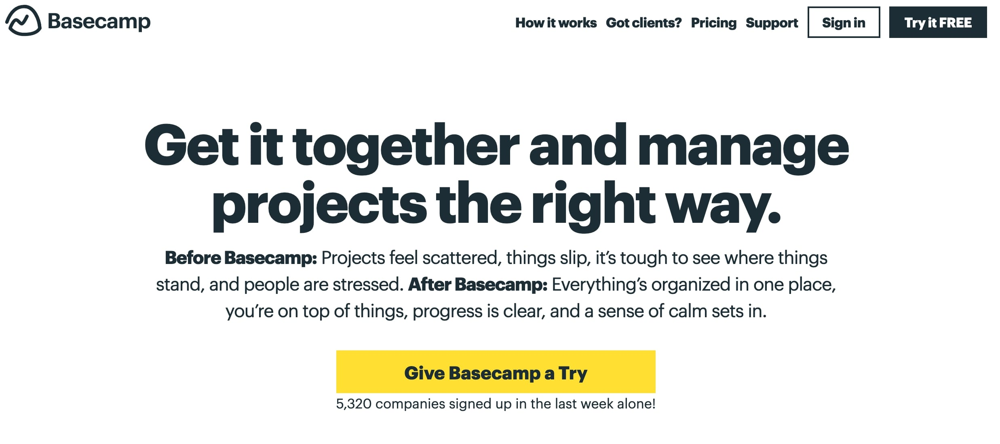

The web has evolved so is the competition. In present days you have few seconds to engage you visitor otherwise it's a lost business. Though people say look doesn't matter, but it does in the digital space. The experience your website or app provides the plays a key role in conversion. A website with an average product but great design/experience can see higher conversion compared to website with great product with a average design/experience. Whether or not a visitor converts into a customer completely depends upon the type of experience you provide.

If you are a marketing guy and reading this, then make sure your business has a great website as that will work 7 days a week and 365 days a year for you and won't even take salary for that. Rather than hiring multiple sales executives, it's better to invest on a great [web experience↗](https://www.letsnurture.com/blog/10-reasons-why-website-user-experience-is-important.html) first. Make sure you correctly identify your target audience and design accordingly, for example don't create a webpage with super small font size if your target audience are senior citizen. Small font size might look great to teenager and young adults but it's a pain for the elders. These small things will go a long way in building an subconscious relation between your brand and customers. Now that you know all these, let's see some great ways to optimize your site for user satisfaction.

## **Clutter Free UI**

No one likes a mess, be it physical or digital. It's always better and safe to keep your design and user interface as simple as possible unless are a design guru. Most people compare simple to boring white and black webpages but that's not the case. Look at [Google's homepage↗](https://uxdesign.cc/google-how-the-biggest-search-engines-homepage-has-changed-over-the-last-20-years-3b59db931a0d) elegant, simple and gets the job done. I believe the minimalistic approach is the best. Try to provide some free space and play with colors. Look at the video by Gary Simon on white space also known as negative space.

<iframe width="560" height="315" src="https://www.youtube-nocookie.com/embed/FvQv5bwkU1s" frameborder="0" allow="accelerometer; autoplay; encrypted-media; gyroscope; picture-in-picture" allowfullscreen></iframe>

Another thing to note, if you are animating vectors or images on your webpage then you better do that is a right way. Keep in mind that not all of your visitors will have a great device, some would be on low-end devices and I'm pretty sure you don't want to mess with that. Always test your user interface on the campiest device you could found. When I design something then I ensure to check it once on Internet Explorer and once on a cheap Android device. If your site works well on low-end devices, then it would work great in general mid-level devices.

## **Clear & Focused CTA**

[Call to Action↗](https://blog.hubspot.com/marketing/call-to-action-examples) or better known as CTA is the key link to conversion and it's your job to ensure its visibility. Always ensure that you CTA is of proper size and appealing color which compliments the aesthetic of the webpage. Also, as I mentioned above minimalism is the key and most of the times rest is more. Refrain from using long phrase on you CTA buttons like "proceed to checkout page" or  "sign up for free trial" instead use phrases like "checkout" and "get started". If you still need to share something use `<small>` tag with very small font and place it below your CTA. This will give you a much cleaner look.

Buffer Landing Page

The placement and color also plays an important role in how effective of ineffective you CTA is, always ensure that the CTA compliments the background and attracts user's focus towards it. Also, if possible place them on different location on your webpage in an (un)obstructive manner. 

## **Faster Speed, Better Conversion**

If you have followed me over past years, then you would surely know I'm a sucker of web performance and I believe you don't want to frustrate your visitor by taking 10-12sec to load your page. Website's that load faster have proven to see [better conversion↗](https://www.cloudflare.com/learning/performance/more/website-performance-conversion-rates/). If you are able to make your webpage load under 3sec then kudos, you rocked it. 

Credit: Cloudflare

Though I have seen lots of websites suck at it, but you shouldn't. If you wish to know in-depth ways to optimize your webpage then (have a look↗)[https://3perf.com/talks/web-perf-101] at this articlr. One of the easiest ways to make your webpage load faster is by optimizing images on your website and switching to a hosting provider with better infrastructure.

## **Provide Point of Interaction**

Just imagine you are at a product page and you have just a small but critical query about it. You try hard to find a way to get in touch, but you couldn't, what will you do? Most of us will look for a different place to buy it and enquire. This the reason why you need to have a point of interaction between your support team and user.

Chat Feature Acts as Quick Bridge Between Customer and Marketing Team

Point of interaction can be in form of chat box (stay away from chat bots, please), mailto and tel links. Adding any of them would ensure you are able to get in touch with a confused user and convert better.

## **Efficient Copywriting**

A website without an appealing text is like a pizza with no cheese. Boring and undesirable. Having efficient copy ensures that user's understands what message you want to convey. Copywriting converts your boring website into a conversion machine by using words that hits the bullseye of user attraction. Learn more about copywriting at [Kopywriting↗](https://kopywritingkourse.com/what-is-copywriting/).

Basecamp Landing Page 2020

As far as I have seen, this is the most neglected part in most of the digital business. Most of the people don't even know the meaning of it. Don't be that guy please. Copywriting is the best way to convey the message your product/service is trying to pass. This will affect your conversion rate significantly.  If you wish to have a helping hand then we are just a [mail↗](mailto:hi&64;devxify.com) away.

## **Wise Use of Colors**

Colors create the first impression in your users mind regarding your brand. Having a color which suites your brand niche is very important for branding as well as marketing. It's a very powerful tool and using it wisely is a skill. Did you know the color you choose affects the behaviour of  you user on the webpage? Colors give you the power to tap into the mindset of the user without letting them know about it.

Illustration by Cindy Chung, Verywell(Original Owner)

Let's understand this with few examples. Have you seen the RedBull logo? The most prominent color there is [red↗](https://www.verywellmind.com/the-color-psychology-of-red-2795821). It signifies the aggressiveness and energetic nature of the brand. Another great example would be Apple's website. Black is the predominant color with pinch of complimenting white. The black of their website signifies the sophistication and exclusivity in their product which is very important for a brand like Apple which is sought of a premium brand.

### **Conclusion**

Even though these might look a lot to implement but it's just the tip of the iceberg. Consider them to be just the basics of UX modification for better conversion. There is still a whole ocean to cover like use of whitespace (aka negative space), color composition, behaviour analytics and much more. If you are a very interested into it then there are lots of such guide available on the web.

If you really liked the article then do share it with your friends and colleagues. If you find a error or just want to do addition to this post then feel free to drop a message on [Twitter↗](https://twitter.com/devxify), also do follow us for quick updates. For weekly updates on web performance and optimization do subscribe to our newsletter. If you wish to support my work (which I do here for free) then you can do so by [buying me a coffee↗](https://www.buymeacoffee.com/Devxify) or two, I'll be thankful.

<!--Comments System-->

