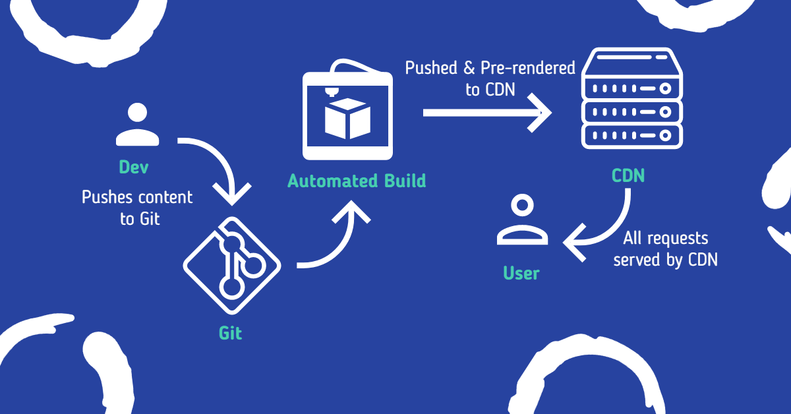
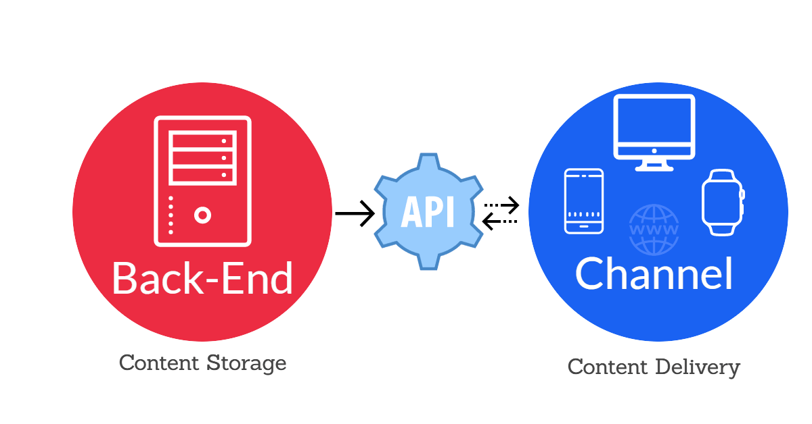

The world of technology is changing faster than one could ever imagine. In fact, the past is repeating itself. The revival of static sites is here but they have evolved with lots of superpowers. The full form of JAMstack is JavaScript, API, Markdown stack. Just like [MEAN stack↗](https://www.ibm.com/cloud/learn/mean-stack-explained), MERN stack it is also a stack. Also, the whole site code lives on CDN so cheaper and faster hosting.

>JAMstack: Modern web development architecture based on client-side JavaScript, reusable APIs, and prebuilt Markup. **- Mathias Biilmann, Netlify co-founder.**

It is a new way of developing and serving web application with better performance, security, and scalability. JAMstack is not a tool, it is a composition of JavaScript, Markdown and API.

JavaScript is used to build the whole site and manage and respond to requests.

API is used to do multiple tasks which makes them equal to full-fledged dynamic sites. These API can be used to perform dynamic tasks like search, form-handling, and others similar tasks.

[Markdown↗](https://www.markdownguide.org/) is an upgraded Markup language just like HTML. This is widely used by static site generators and headless CMS for content on site.

Just like maple syrup goes complimentary with pancakes, JAMstack also has some technologies which compliments its existence.

**SSG** (bridge between hard coded html and CMS) **PWA** (client-side caching, offline capability & installable) **Serverless** (easy backend with use-as required model)

Though they got developed individually but these are got combined together upon maturity and development. All these together contributed to similar vison of faster browsing, easy development control and reduced vulnerability.

## **Why JAMstack Came into Existence?**

Before JAMstack the web was pretty much dominant by the LAMP and MEAN stack. As the usage of mobile devices increase so did the demand for light weight web technologies. The people surfing the web wanted things to load in a breeze. Big brands like Google and Facebook heard it and started to develop something or the other.

In 2016, Google started testing its AMP project rigorously. [AMP project↗](https://amp.dev/) was meant to create AMP pages instead of normal web pages, its major components were AMP-HTML, AMP-Cache and AMP-JS. The key thought process behind this was to create a static version of a page and then serve it rapidly using Google’s globally distributed AMP CDN.

Facebook even started testing a same thing is 2015 known as [Instant Articles↗](https://developers.facebook.com/docs/instant-articles/), it too came with the same goal of making web pages load faster on a every device irrespective of network or computing limits.

The only answer to these needs were to build a completely new stack which required little to no computing. That is when static became the new need of market. With all the progressive enhancements we got the stack which we now call [JAMstack↗](https://jamstack.org/).

## **Advantages of JAMstack**

**Better Performance -** As the whole site lives on global CDN network hence the content is delivered at a faster pace.

**Secure -** As JAMstack sites are more of a static site, which means they lack databases. This makes them very less vulnerable to cyber-attacks.

**Cheap or Free Hosting -** JAMstack site require no computing and the only resources they consume are bandwidth and storage. You can easily get free hosting for your JAMstack site from Vercel and Render.

**Easy Version Control -** Developers tend to often break something or other while pushing new features or upgrades. The beauty of JAMstack is that it is based-on Git and every change can be reversed with click of a button.

## **Thin Border Between Frontend & Backend**

As [Christian Nwamba↗](https://twitter.com/codebeast/status/1133927268697305091) once said that the line between frontend and backend is shrinking is due to the continuous progressive development in JAMstack. Developers need not manage the backend and frontend separately. JavaScript is the only programming language they need to manage bits of their application. Most of the heavy lifting and dynamic features are manged by wide number of APIs and SaaS providers.

**Here is a shot list of things that can be easily offloaded:**

- Form Handling
- Full Site Search
- Image Delivery
- Comment System
- Custom Functions
- User Authentication
- Backend Functionality

These are just a few, there are plenty more. You can easily Google them as find ones that suits your need the best.

## **JAMstack Workflow**

The whole concept of JMAstack is to serve static webpages. For the same reason JAMStack has a pretty easy workflow to understand, we tried to illustrate it using the graphic below. Do have a look on it.

JAMstack Workflow

## **JAMstack Edge’s Over Traditional Stack**

JAMstack is a way different than traditional stack. JAMstack’s build and hosting are two different processes and has different architecture. While the build process is done via standard build engine while hosting is managed via a globally distributed CDN nodes. While in a traditional stack the build and hosting are coupled into one backend server.

|JAMstack                                | MERN/MEAN stack                    |
|----------------------------------------|------------------------------------|
| Build & Hosting decoupled              | Build & Hosting Coupled            |
| Whole application served via CDN       | Only static assets served via CDN  |
| Content managed by GIT or Headless CMS | Content Managed by traditional CMS |

## **Benefit of Headless CMS Over Traditional CMS**

Since existence JAMstack site have always been running parallel to headless CMS. Unlike traditional CMS like WordPress where backend and frontend are tied into one single unit, in headless CMS the frontend and backend are completely different units. [Headless CMS↗](https://www.storyblok.com/tp/headless-cms-explained) only builds the page when changes are pushed and same is served until new changes are received whereas traditional CMS builds page on every request. This gives JAMstack’s headless CMS and performance edge over traditional CMS.

Headless CMS

## **Why JAMstack Could Be The Next Big Thing**

Well I say so because of the great hidden potential I see in it. JAMstack has revolutionised they way we use to develop sites, from managing servers to pushing changes on git and from handling security issues regularly to near to nil security issues.

JAMstack has proved its effectiveness to developers and big brands by providing better performance, higher security, and low operational cost. As we all know that [performance is the key conversion metric↗](https://www.cloudflare.com/learning/performance/more/website-performance-conversion-rates/), so this technology is leveraged to get the maximum out of it. JAMstack has made managing and collaborating to any project way more easier using Git.

## **Conclusion**

JAMstack is still a new kid in the block. You can call it a work in progress thing too. Though its still not able to completely replace every other web development technology but we see a great future ahead. Make sure to keep your eyes on this and use wherever possible to develop performance-oriented web application.

If you really liked the article then do share it with your friends and colleagues. If you find a error or just want to do addition to this post then feel free to drop a message on [Twitter↗](https://twitter.com/devxify), also do follow us for quick updates. For weekly updates on web performance and optimization do subscribe to our newsletter. If you wish to support my work (which I do here for free) then you can do so by [buying me a coffee↗](https://www.buymeacoffee.com/Devxify) or two, I'll be thankful.

<!--Comments System-->

