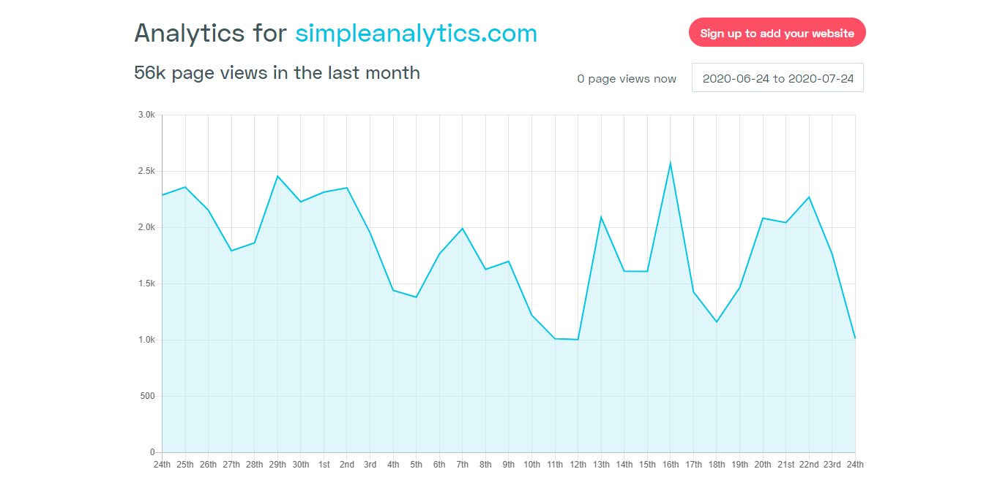
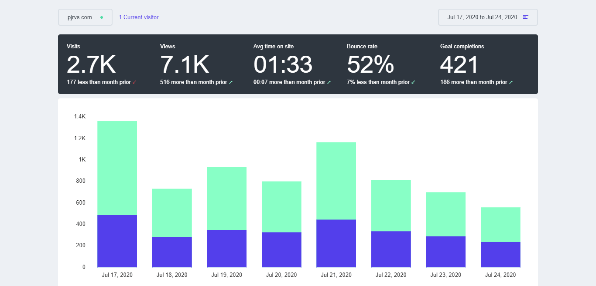
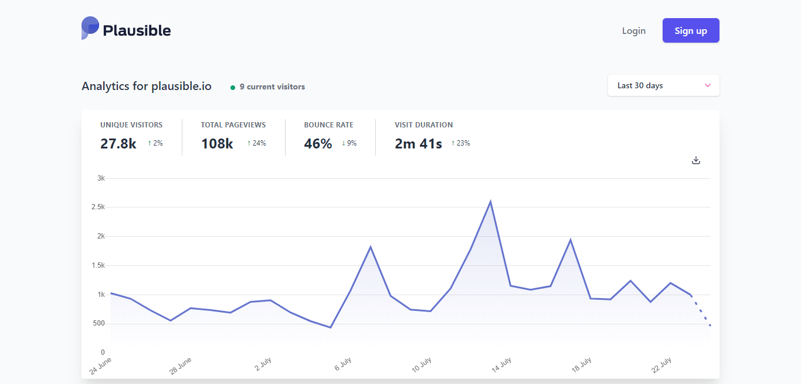

In this article we are going to compare privacy friendly analytics such as Simple Analytics, Fathom and Plausible, let's begin the journey.

In recent years we have seen a drastic rise in awareness about privacy. Also the new law like [GDPR↗](https://gdpr-info.eu) have forces businesses to take privacy in a serious way. It was something we all needed; don't you have seeing an ad about the product you were looking for?

There were (and still) are some excessive tracking and privacy violation on the web. Companies like G##gle and Faceb##k had created their whole business model over selling and mishandling user data. Analytics played a key role there. Most of the part of user tracking and tracing were done by analytics owned by large giants like them. With the increase in awareness there came demand of privacy first products. One such domain was privacy friendly web analytics. Privacy have become one key decision making point in choosing analytics for a website.

Another great reason to use them is that you get free performance boost. GA makes your site lag with tons of JavaScript, choosing one of them ensures that your analytics doesn't make your site slow.

Here’s the brief overview of script sizes:

1. Simple Analytics- **5.4 kB**
2. Fathom- **4.8 kB**
3. Plausible- **1.3 kB**

Want to know where Google Analytics stand?

**45.7 kB**, about 10x the average size.

In past few years we have seen how the demand made multiple players and individual players enter the ground to compete. As of now there are 3 well known "Cookie-Free & Privacy Friendly" web analytics service, namely Simple Analytics, Fathom and Plausible. All three are made by owned and well managed by team of Indie Hackers who are aggressively bootstrapping their business. Also, a very important point is that by using any of these service you get the option to skip the cookie pop-up and it does makes the UI cleaner. Let's take a quick dive and see what are they offering and how different they are from each other.

> **Note:** All three come with basic features like tracking no. of visits and visitors, they all also provide geographical data which is mostly accurate (not 100% though). Along with this they also give you a brief of top referrers and top pages. These three also give you an easy way to share your dashboard to the public for visibility to all (only if you wish). As these are common among three so I won't be mentioning these, among others.

## Simple Analytics

Now this is the product that I have known since the days it was just a beta (as the product was built in open) and a one-person lead company. They started in the year 2018 and since then they have been pushing improvements daily. As the name suggests their service is based upon simplicity, if you will look at their dashboard then you will be quickly able to understand this. Though don't look the most intuitive among then others but they really have some really great stuff under their belt.

One their unique feature which I love the most is that you can track all the tweets on Twitter linking back to your webpage's, that means no more seeing confusing links from t.co, this alone cloud be a separate offering but it's good to have. <a rel="sponsored" href="https://www.devxify.com/go/simple-analytics">Simple Analytics↗</a> also lets you have custom domain/sub-domain for you tracking URL. It's very useful, trust me when I say that. Using this simple method, you will be able to bypass most of the blockers around the web. Though you will find this same feature in others too, but they were the first one to implement this (Ahem! Ahem!). 

Simple Analytics Dashboard

Simple Analytics also supports event tracking like Google Analytics but in a cookie less way, though it's still in beta as of now but you can try it too. I also want to disclose that I have been using their service personally and I do plan to continue along with them in the future too. Another benefit you will find that reaching the team is extremely easy (benefits of working with startups), once I had an issue in tracking in my region and I mailed them, [Adriaan↗](https://twitter.com/AdriaanvRossum) (Maker of Simply Analytics) quickly got in touch with me and helped me solve it. Till date the only cons I was able to find is that, I tried to find cons but failed, I did had some feature requests (Feature such as Time On Page is in progress and Bounce Rate is planned). Really wish that these two get implemented soon, if you are a Simple Analytics customer then please go and give a like to the issue on GitHub to increase priority. 

Price of Simple Analytics start from 19$ per month or 108$ per year for 100k pageviews and unlimited sites. Though the monthly price is bit high, but the yearly plan is very well priced. For just above 100 bucks you will be contributing to make the web privacy friendly and also will be able to own the data. If you wish to try their product first then you can opt for a free trial too.

## Fathom Analytics

Correct me if I'm wrong but Fathom Analytics is the oldest among the three. <a rel="sponsored" href="https://www.devxify.com/go/fathom">Fathom Analytics↗</a> was started Jack & Paul in 2018 and since then they have been bootstrapping. One of the non-functional part I love about them is their color palette which looks so tempting to your eyes. Now let's back to their core offerings. As much as I experienced it looks like a much closer privacy friendly competitor of Google Analytics. Apart from just telling you about number of visits and visitors they also tell you the average time on page (dwell time) and they even calculate bounce rate for you. These two features alone are enough to help marketers help optimize content on page and improve low performing pages. 

Fathom Dashboard

Fathom Analytics have some other cool and unique features too like they offer free uptime monitoring. This makes their offering super tempting as you will be able to save few bucks which were supposed to be spent on a uptime tool. They use PingPing to monitor and notify you about any downtime, you can choose to get notified with a wide array of method including mail, slack, text-message, and telegram. They also support unlimited email reports to unlimited people, this comes really handy when your business has multiple people operating it. I really wished Simple Analytics had this option, the only way around is to take the higher plan but that still has a different way implementation most of you won't want.

Just like Simple Analytics, Fathom also supports event tracking in form of goals (it's named goals too). Using this you can easily track actions like number of clicks on a particular link or number of signups. It's pretty cool and handy. Recently they have also implemented support for custom domains so that you can bypass ad-blockers and you are using a privacy friendly tool and don't deserve such harsh blockade. 

Fathom Analytics is priced at 14$ per month and 140$ per year for 100k pageviews and unlimited sites. They are among the most expensive one but it ok by European and US standards (I'm from India where the value of dollars is a bit high). For 140$ a year you get a privacy friendly analytics tool, an uptime monitor and ownership of you data. They too have a trial if you wish to have it.

## Plausible

Plausible is youngest among the three. [Uku Täht↗](https://twitter.com/ukutaht) first started it and then [Marko Saric↗](https://twitter.com/MarkoSaric) joined him soon. It was launched in 2019 by Uku as a budget friendly and privacy focused & cookie free analytical tool. (BTW, I love how their dashboard looks. Your views might defer.) 

Plausible is a fairly new to the market so I can't expect much of unique and advanced features but there are still some worthy of mention. One of them is that you can connect [Plausible↗](https://plausible.io) to your Google Search Console and pull some of the data from there, by doing this you can easily check your top pages and on traffics by Google search. Though you can easily see the same data on Google Search Console dashboard by having all at one place does makes it handy. Also, they have recently added support for time on page too. Just like the other two, Plausible too has support for goals & conversions tracking. The trigger can be either a pageviews in a certain page or a custom event. Also just like Simple Analytics it also shows all the tweets mentioning your website in them, it's good to have it but I sincerely thing that there is a way of improvement in the UI (Would be great if the team works on it after reading this).

Plausible Dashboard

Though Plausible is not the tool with the most number of features but it does have one large benefit over others, that's pricing. It's the cheapest among its competitors, for reference it would cost you 12$per month or 96$ annually for 100k pageviews and unlimited sites. Though this is not the magical part. The thing is they have found a sweet gap where people you and me who have just a simple portfolio site need a smaller plan and they are the only one offering it. Their smallest plan with 10k pageviews cost only 6$ per month or 48$ annually and that's what help them reach a larger number of small sites. It's always good to have players like these as not all site owners are able to pay larger sum of amount. I do think that others must also come up with smaller plans. 

### Which One Is For You?

Now this is question most of you might have. I know and understand this, and I think that I can help you choose one based upon your use case and other factors. Check the below list for all conditions and find your perfect partner.

1. **Does your budget allows you to go as high as triple digit dollar figures?** If **yes** then you can Fathom (Great UI, uptime monitoring plus few extra stuff). If **no** then blindly go with Simple Analytics or Plausible (Simple Analytics monthly plan is priced a bit high, prefer the yearly plan. Plausible is the cheapest one though).
2. **Do you wish to track tweets in a proper way?** If **yes** then Simple Analytics (implementation is just perfect) is the one to go. You can also track tweets with Plausible too.
3. **Do you have an agency and wish to automatically share logs/reports with you clients?** If **yes** the Fathom is the only one supporting it as of now.
4. **Do you wish to have a nice support team?** If **yes**, then the answer would be all three of them. Most bootstrapped business care their customers in a proper way.
5. **Need to monitor uptime too along with analytics?** If **yes**, then the only one is Fathom.
6. **Last but not the least, do you love privacy?** If **yes**, then go with any of the three mentioned above (**Simple Analytics**, **Fathom** & **Plausible**). If **no**, then go with the one whose name is forbidden in my books.

Now that you have a good idea of all the three, which one are you going with? Also if you still have doubts the the comment section is open for you and I'm pretty active there. Another note worthy thing to mention is that Simple Analytics let's me gift you a **free month** of their service and I'm an existing user, simply click on <a rel="sponsored" href="https://www.devxify.com/go/simple-analytics">this link↗</a>. If the founders of Fathom and Plausible wish to distribute a coupon or extended trial, then do drop a text and I'll add it here.

If you really liked the article then do share it with your friends and colleagues. If you find a error or just want to do addition to this post then feel free to drop a message on [Twitter↗](https://twitter.com/devxify), also do follow us for quick updates. For weekly updates on web performance and optimization do subscribe to our newsletter. If you wish to support my work (which I do here for free) then you can do so by [buying me a coffee↗](https://www.buymeacoffee.com/Devxify) or two, I'll be thankful.

<!--Comments System-->

